# 界面可见功能

手机屏幕上**真的能看到、能点**的东西，按屏幕区域拆到最小单位。

与 [FEATURES.md](FEATURES.md) 的分工：那份从代码出发，含大量用户看不见的后端机制（可靠投递、审计、协议桥接）；这份只收界面上存在的交互面。

**图怎么来的**：全部由 [`e2e/ui-shots.spec.js`](../e2e/ui-shots.spec.js) 对着 mock app-server 实跑产出，Pixel 5 视口（393×727，dpr 2）。图上的红框和编号是截图前注入页面的，**靠选择器定位**——选择器失效直接抛错，`npm run test:e2e` 变红。

改了 UI 之后重新生成：

```bash
npm run shots
```

`npm run test:e2e` 只验证不写盘。这样拆是因为 28 张里有 7 张每跑一次就变（项目名是随机临时目录、延迟毫秒数、thread id 时间戳、累积 token 数），每次 e2e 都吐 7 张图的 diff 只会让人养成无脑丢弃这个目录的习惯。**代价**：UI 只改了颜色或文案、选择器没动时，图会滞后到下次手动重跑——这种情况没有自动手段能发现。

**编号对应表格的 `#` 列**。自带文字标签的区域（工具面板、斜杠命令、设置选项）只圈红框不打编号——第一版给它们都编了号，结果气泡把按钮文字盖成了「Th①ds」。

`#` 列写 `—` 表示 mock 环境造不出这个状态，每节末尾写明原因。

---

## 1. 顶栏（常驻）

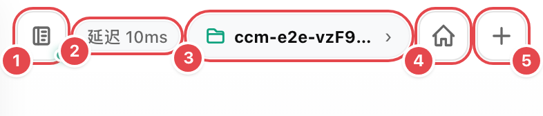

| # | 元素 | 看到什么 | 点了做什么 |
|---|---|---|---|
| 1 | 会话按钮 + 状态点 | 图标，右下角圆点表示连接状态 | 打开左侧抽屉 |
| 2 | 延迟胶囊 | `延迟 2ms`，慢时变色 | — |
| 3 | 项目胶囊 | 当前工作区名，右侧可带改动数徽标 | 打开工作区面板 |
| 4 | 首页按钮 | 房子图标 | 回到空会话 |
| 5 | 新建按钮 | 加号图标 | 创建新会话 |
| — | 工作区下拉 | 仅配置了多个 `WORK_DIRS` 时出现 | 切换工作区 |

**无图的原因**：mock 只给一个 `WORK_DIRS`，`#workdir-container` 是 `hidden`。要截它得起一个配了多工作区的实例。

⚠ **顶栏里看不到的**：`#thread-title`（会话名）和 `#state-label`（idle/busy）虽有内容，但高度被压成 1px + `overflow:hidden`；`#session-meta` 和 `#status-detail` 是 `display:none`，全表没有规则打开它们。

---

## 2. 左侧抽屉

### 2.1 会话列表

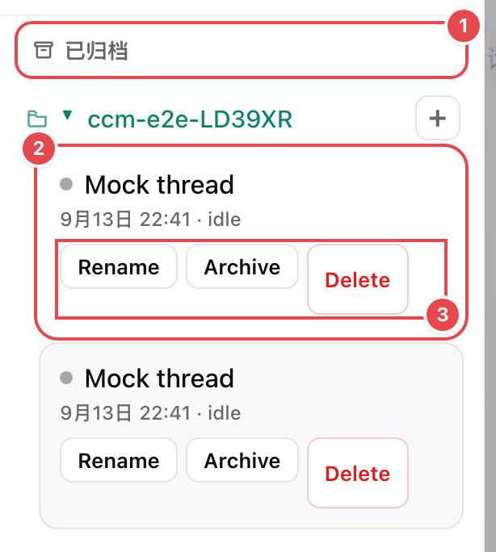

| # | 元素 | 看到什么 |
|---|---|---|
| 1 | 已归档切换 | 固定在滚动区外，不会被长列表滚走 |
| 2 | 会话条目 | 按项目分组，显示标题与相对时间 |
| 3 | 条目操作 | Rename / Archive / Delete |

### 2.2 工具面板（5 个按钮，全部可见）

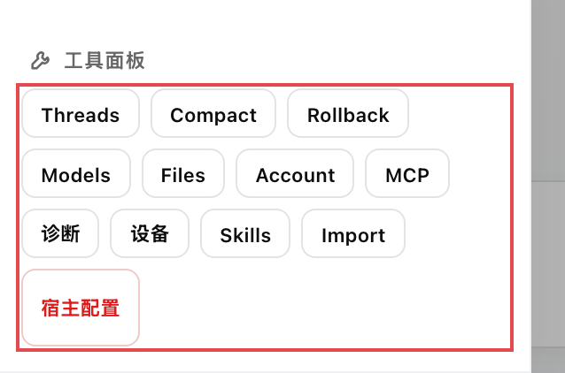

只留「对当前会话/工作区做事」的按钮：

| 按钮 | 打开后看到 |
|---|---|
| Threads | 原生会话列表 |
| Compact | 压缩当前上下文 |
| Rollback | 回退 N 轮（要求输入轮数） |
| Models | 模型能力列表 |
| Files | 只读文件浏览器 |

面板下方是常驻的**设置与状态**入口（图上第二块），点开见 2.3。此前这里平铺着 12 个按钮，
没有分组，找一个要把全部扫一遍。

### 2.3 设置与状态

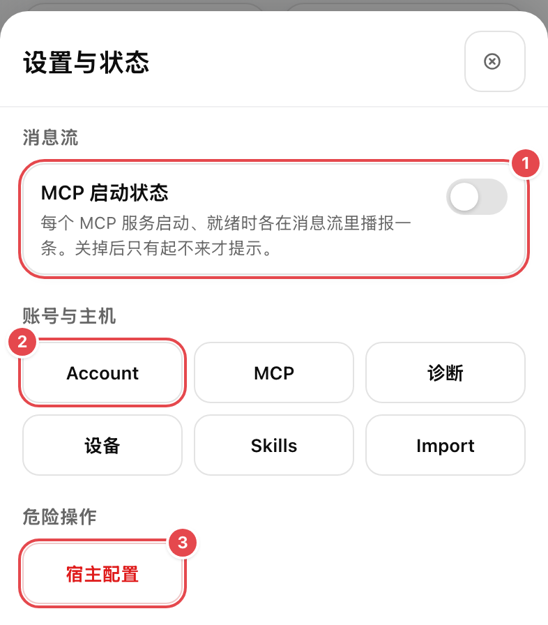

抽屉底部入口拉起的底部 sheet。与输入区的**会话设置**（见第 5 节）按作用域分开：
那边是 model · permission · effort，换台设备打开同一会话仍然成立；这边是本机偏好
与主机状态，换台设备就该重新选。

| # | 分组 | 内容 |
|---|---|---|
| 1 | 消息流 | **MCP 启动状态**开关（默认关）。关掉后 starting / ready 不进消息流，只有起不来才提示 |
| 2 | 账号与主机 | Account（账号、用量、速率限制）、MCP（服务器状态）、诊断（分层连接诊断）、设备（已接入设备，可撤销）、Skills（列表与启用状态）、Import（探测并导入 AGENTS.md / CLAUDE.md） |
| 3 | 危险操作 | 宿主配置：改 config、插件、marketplace、MCP 调用、登出（红色标记，每项单独确认） |

⚠ **开启推送通知**按钮在「消息流」组里，只在浏览器支持且 VAPID 三项配齐时出现，因此不在图上。

---

## 3. 消息流

### 3.1 空会话

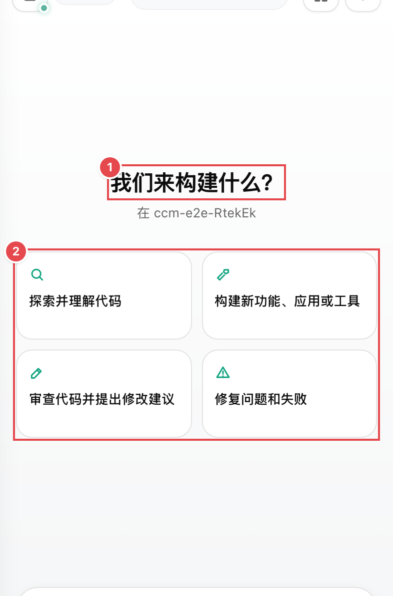

| # | 元素 | 看到什么 |
|---|---|---|
| 1 | 大标题 | 「我们来构建什么？」+ 当前项目名 |
| 2 | 建议卡片 | 四张：探索并理解代码 / 构建新功能、应用或工具 / 审查代码并提出修改建议 / 修复问题和失败（点击填入输入框） |

### 3.2 有消息时

编号跨图唯一，一行对应一个卡片类型。

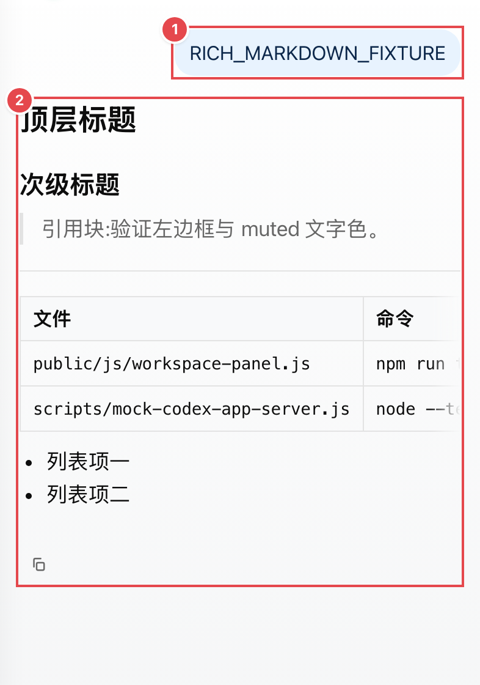

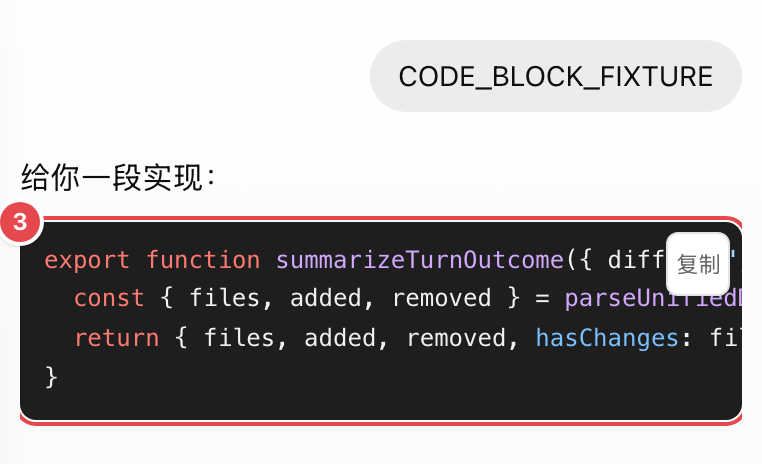

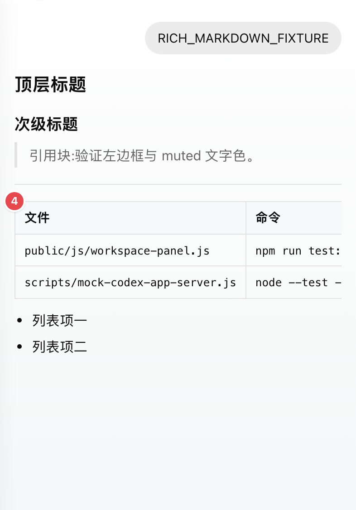


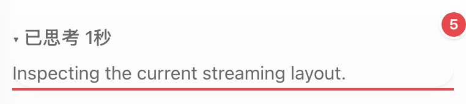

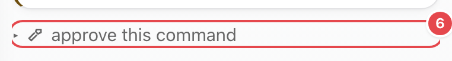

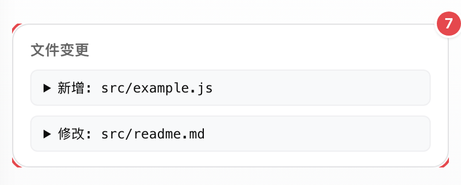

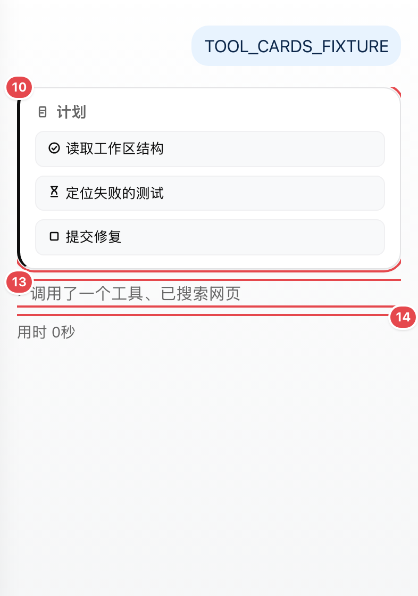

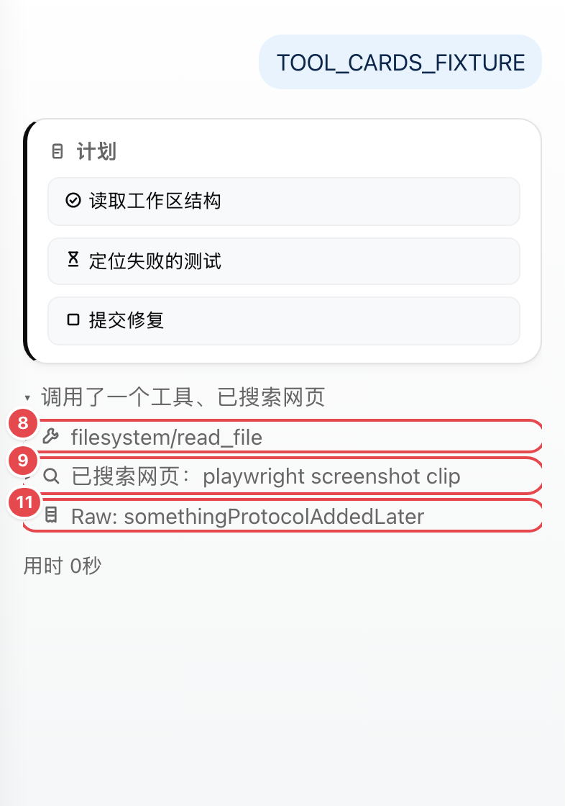

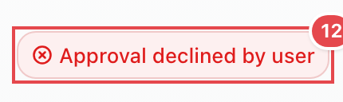

**过程和结论分两种形态**（抄 ChatGPT 桌面端）：工具执行的过程收成**一行灰字**（活动行），可点开看详情；需要你处理的、或属于结论的，仍然是**卡片**。分界就在「用时 N 秒」那条分隔线上——它上面是过程，下面是最终回复。

| # | 元素 | 看到什么 |
|---|---|---|
| 1 | 用户气泡 | 右对齐 |
| 2 | 助手正文 | 全宽无气泡，Markdown 渲染：标题、表格、引用、列表、分隔线 |
| 3 | 代码块 | 语法高亮 + 复制按钮，暗底，超宽时自己横向滚动 |
| 4 | 宽表格 | 自己横向滚动，不撑破正文；溢出时边缘渐隐，提示还能往右滑 |
| 5 | thinking / reasoning | 可折叠，默认收起。三态：「正在思考」→「已思考 4秒」，量不到耗时时是「已完成思考」 |
| 6 | 命令活动行 | 收起时一行（跑挂了行首变红并缀「· 失败」），展开看命令、输出、退出码 |
| 7 | 文件变更活动行 | 一个文件显示路径，多个显示「编辑了 N 个文件」，展开看 diff |
| 8 | MCP 调用活动行 | `服务器名/工具名`，展开看参数与结果 |
| 9 | 搜索活动行 | 「已搜索网页：<query>」，展开看标题、URL、摘要 |
| 10 | 计划卡片 | 待办列表与状态（✓ 完成 / ⌛ 进行中 / □ 待办）。**仍是卡片**：它是当前状态，不是做过的事 |
| 11 | Raw 活动行 | 未识别的 item 降级显示，不静默丢弃。不进活动摘要 |
| 12 | 系统消息 | 灰色居中，错误为红色 |
| 13 | 活动摘要 | turn 结束后，相邻的活动行折成一句过去时（「已搜索网页、运行了命令」）。整组是同一个工具时改用计数（`read_file · 3 次调用`） |
| 14 | 「用时 N 秒」 | 活动区与最终回复之间的分隔线 |
| 15 | 复制按钮 | turn 末尾，复制本轮回复的 markdown 原文 |
| — | 等待态 | 发出消息到助手开口之间，显示「正在思考」四个字，一道微光从左扫到右（不是三个点）。**无图**：它只存在于 turn 开头的一瞬，截图脚本抓不稳 |
| — | turn 终态 | 完成 / 失败 / 中断的摘要 |

**只有一条活动时不折叠**：它本来就只占一行，再套一层「运行了命令 ▸」反而多一次点击才看得到内容。

**无图的原因**：turn 终态由 `summarizeTurnOutcome()` 从本轮聚合 diff 与命令退出码导出，mock 的回合不产生聚合 diff，卡片因此不渲染。

### 3.3 审批与提问（出现在消息流里）

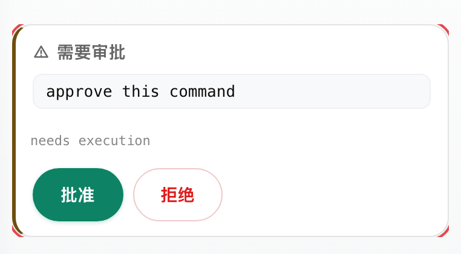

- 命令执行审批卡：命令正文 + 批准/拒绝按钮（图上这张）
- 文件改动审批卡、权限升级审批卡 —— **无图**：mock 只发命令类审批请求
- agent 提问表单（自由文本或选项按钮）—— **无图**：需要上游发 `user_input_request`
- 审批被上游撤销时卡片自动关闭 —— **无图**：是一个状态变化，静态截图看不出来

### 3.4 浮层

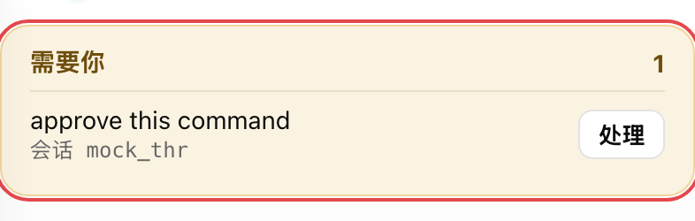

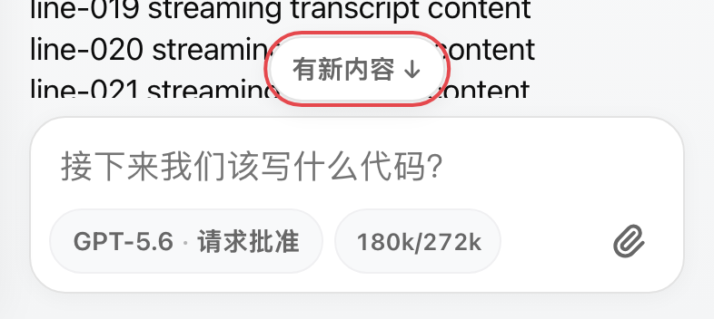

- **需要你**面板：跨会话待办聚合，点击跳到对应会话（图上这张）
- **有新内容 ↓**：滚动位置不在底部且有新消息时出现（图上这张）
- **待批准设备**面板 —— **无图**：要有新设备发起接入
- **连接横幅**（连接中 / 断开 / 重连中 / 立即重试）—— **无图**：要把服务端打断，会连累同批跑的其他 spec

---

## 4. 输入区（常驻）

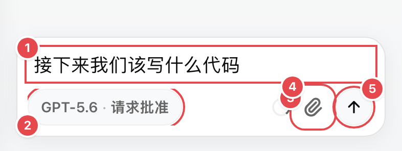

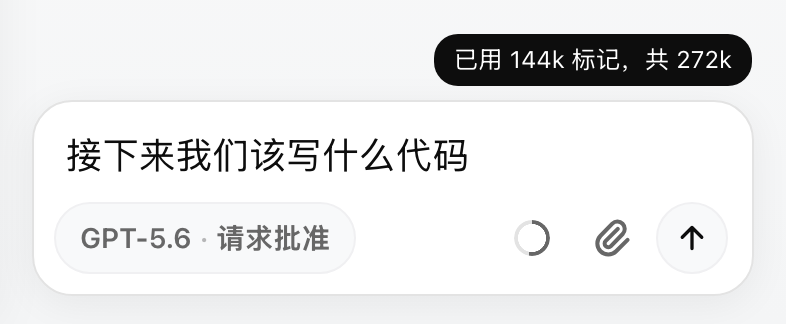

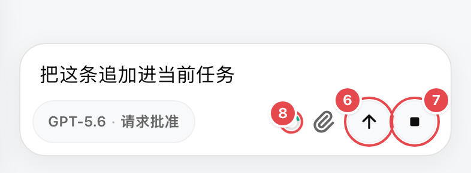

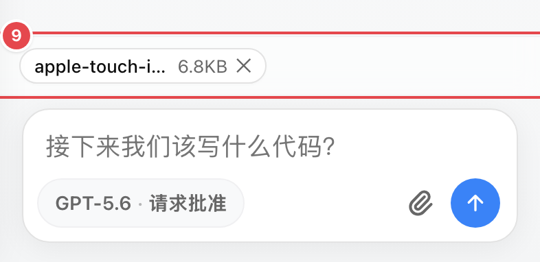

| # | 元素 | 看到什么 | 操作 |
|---|---|---|---|
| 1 | 输入框 | 占位符「接下来我们该写什么代码？」，自动增高 | 输入消息 |
| 2 | 设置胶囊 | `GPT-5.6 · 请求批准`（模型 · 权限，可带模式与强度） | 打开会话设置 |
| 3 | 上下文用量环 | 18px 小圆环，按百分比填充，逼近上限变黄/红 | 有用量后才出现；点一下在输入框上方弹出具体数字（「已用 36k 标记，共 272k」），再点或点别处收起 |
| 4 | 附件按钮 | 回形针 | 选文件；也支持粘贴图片 |
| 5 | 发送按钮 | 有内容时出现 | 发送 |
| 6 | 追加按钮 | turn 进行中**且输入框有内容**时出现 | 追加到当前任务或排队 |
| 7 | 停止按钮 | turn 进行中，替代发送按钮 | 中断当前 turn |
| 8 | 附件托盘 | 文件名 + 大小 + ✕ 的 chip 列表 | 点 chip 预览（仅图片）、✕ 移除 |

**没有单独的「加载指示」**：原先 turn 进行中会多一个小转圈，ChatGPT 桌面端那条输入栏里没有这个东西（它那个圆是上下文用量环，不是 loading）。停止按钮本身就说明在跑，消息流里还有「正在思考」，第三个信号是冗余。

**输入时触发的浮层**：

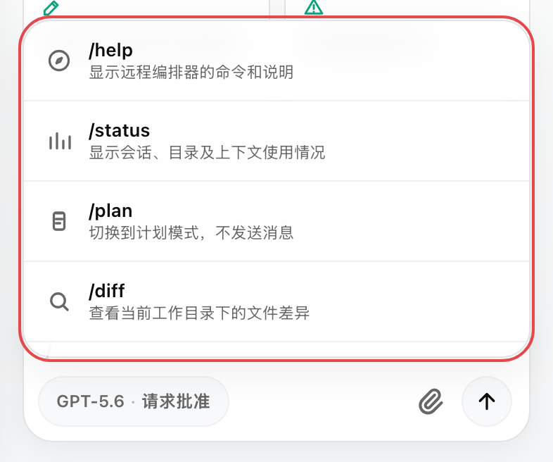

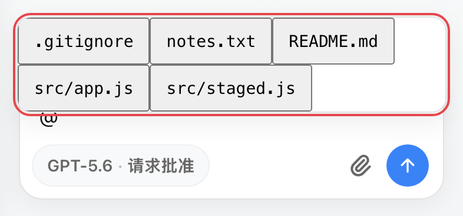

- `/` → 斜杠命令面板：`/help`、`/status`、`/plan`、`/diff`、`/review`、`/compact`、`/permissions`（每条带说明，可继续输入过滤）
- `@` → 工作区文件搜索，选中后插入引用

---

## 5. 会话设置面板

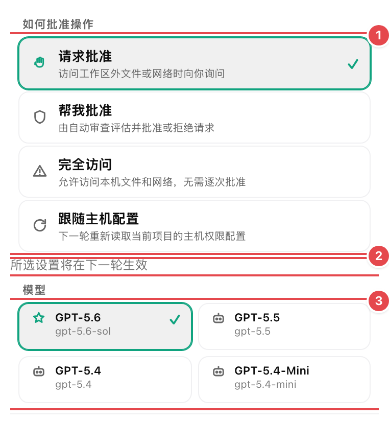

点设置胶囊打开。**权限**（4 项）：

| # | 选项 | 含义 |
|---|---|---|
| 1 | 请求批准 | 逐次审批（默认） |
| 1 | 帮我批准 | 自动审查 |
| 1 | 完全访问 | 免审批 + 完全沙箱（需二次确认） |
| 1 | 跟随主机配置 | 用宿主机 config.toml 的设置 |

图上 2 是下方那行状态说明：`所选设置将在下一轮生效` / `当前已生效` / `主机配置已应用`。主机策略禁止的模式显示为不可选并给出原因。

图上 3 是**模型**（来自 `model/list`，mock 下 4 个）。再往下还有**推理强度**（低/中/高/超高/最大）、**速度**（标准/快速）。

**会话模式**：对话模式（Chat）可选；计划模式（Plan）**固定禁用**，提示「当前稳定协议尚未提供已验证的模式切换能力」。

**高级设置**（默认折叠）：

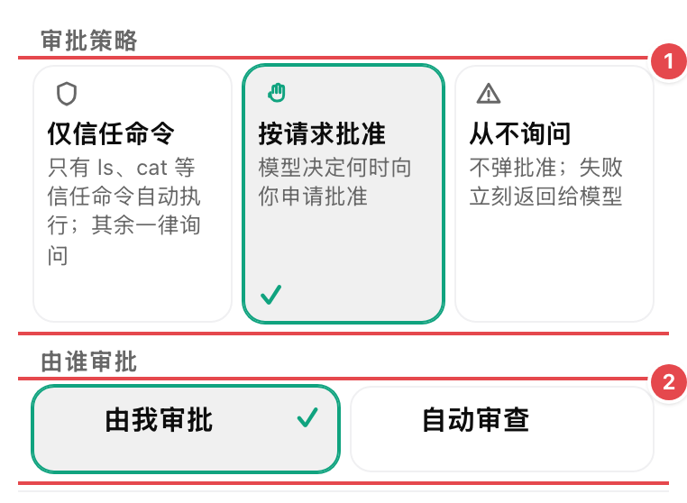

- 审批策略（图上 1）：仅信任命令 / 按请求批准 / 从不询问
- 审批人（图上 2）：由我审批 / 自动审查
- 细粒度审批：沙箱外操作、规则匹配、技能调用、权限申请、MCP 追问
- 沙箱：只读 / 工作区可写 / 完全访问
- 当前生效值：JSON 原文（未拿到时显示「等待当前会话返回配置」）

---

## 6. 工作区面板

点顶栏项目胶囊打开，两个标签页。

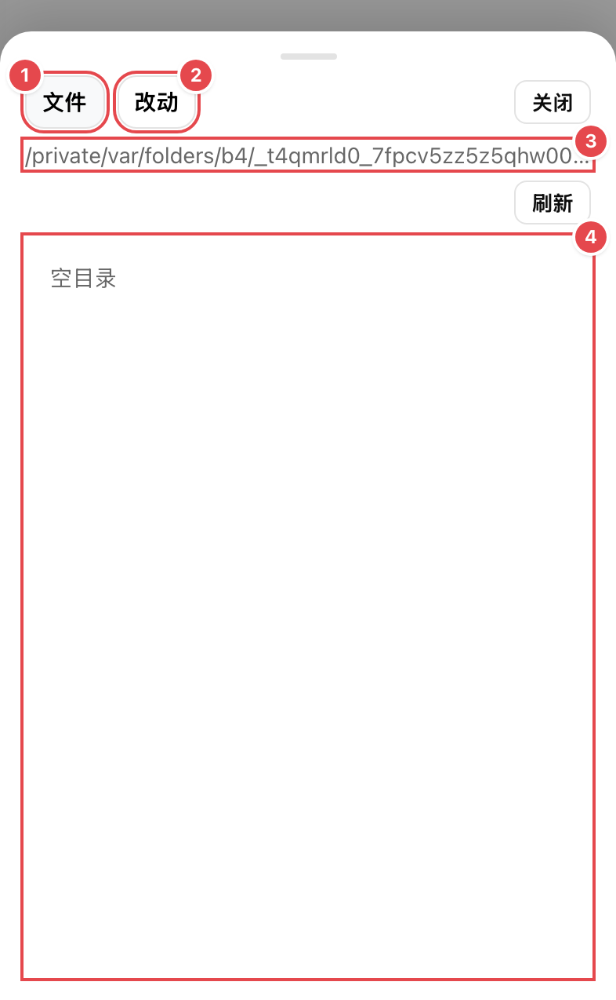

**文件**：标签切换（图上 1、2）、当前路径（3）、目录浏览与文件预览（4，前 8000 字符）。进入子目录后左上角出现 ← 返回；选中文件后有「引用到输入框」按钮。

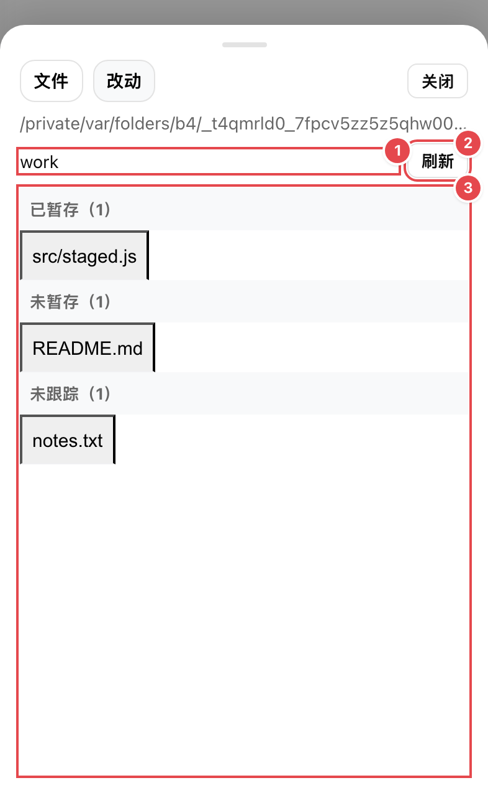

**改动**：分支名（图上 1）、刷新按钮（2）、按 已暂存 / 未暂存 / 未跟踪 / 冲突 分组的文件列表（3）。点文件看 diff（增删行着色）。

---

## 7. 全屏对话框


| 对话框 | 何时出现 |
|---|---|
| 确认 sheet | 危险操作前（删除、完全访问、宿主配置…），部分需输入确认文本（图上这张是切「完全访问」触发的） |
| 附件预览 | 点附件 chip，全屏看图（图上这张） |
| 访问口令 | 未认证时，输入 `AUTH_TOKEN` —— **无图**：E2E 把 `AUTH_TOKEN` 设成空串，这道门不出现 |
| 等待设备授权 | 新设备待批准，显示设备 ID 和批准命令 —— **无图**：要走完整的设备接入握手 |

---

## 8. 全局表现

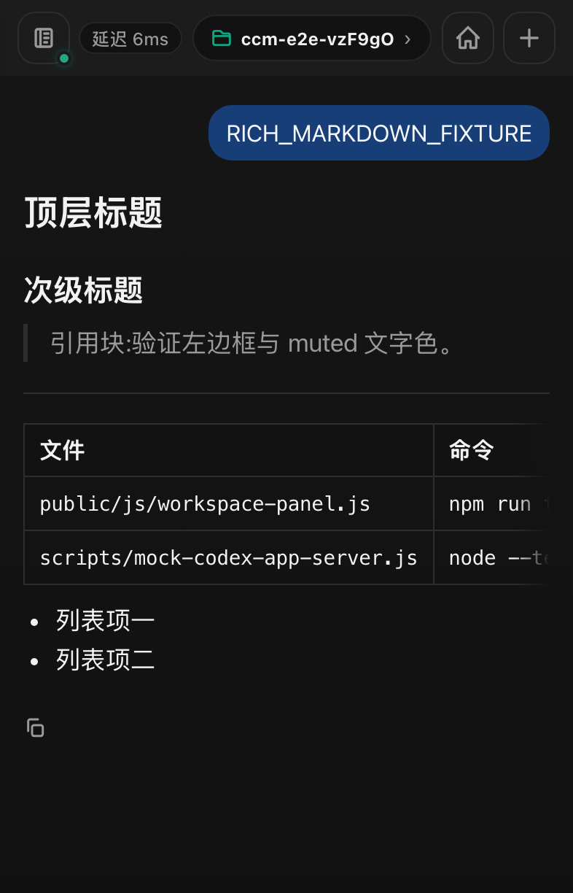

- 浅色 / 深色跟随系统（图上这张是深色）
- 软键盘弹出时布局自适应（`visualViewport`）—— 无图：无头浏览器没有软键盘
- 可安装为 PWA（Service Worker + manifest）—— 无图：安装流程在浏览器 UI 里，不在页面上
- 后台时通过 Web Push 收审批、结果、错误、权限变更、进程退出通知 —— 无图：通知由系统绘制
- turn 完成有无障碍播报（屏幕阅读器可听，视觉上不可见）

---

## ⚠ 界面上看不到的元素

实跑测量确认，以下在 HTML 里存在但用户看不到。列出来是为了避免误以为它们在工作：

| 元素 | 状态 | 说明 |
|---|---|---|
| `#thread-title` | 高 1px + overflow:hidden | 有内容（会话名）但视觉不可见 |
| `#state-label` | 高 1px + overflow:hidden | 有内容（idle/busy）但视觉不可见 |
| `#session-meta` | `display:none` | 全表无规则打开 |
| `#status-detail` | `display:none` | 全表无规则打开；上下文占用因此改放 composer |
| `#model-input` | `display:none` | HTML 注释标为 legacy 兼容字段 |
| `#perm-select` | `display:none` | 同上 |
| `#turn-announcer` | `.sr-only` | 有意的：只给屏幕阅读器 |

`#state-label` 虽然人眼看不见，但 `textContent` 仍在更新，所有 E2E（包括截图 spec）都靠读它来判断连接是否 idle。
